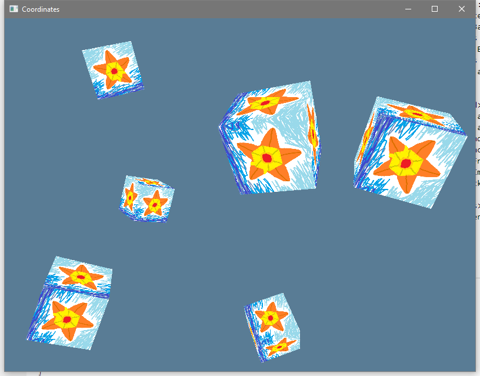

# Coordinates

So, when we did the Quad in the textures lesson, you may recall that it was
(x,y) for the base corner, and then width and height for the size, and then we
used the base corner plus the width and height to find the other three corners.
One of the non-base corners added the width to x, one added the height to y, and
one did both of the adds at the same time. How do we know that `x` and `width`
go together? Why doesn't `x` go with `height`? That's just kinda the convention
that you learn in school. `x` is horizontal with bigger values going to the
right, and `y` is vertical with bigger values going up. This is part of the
[Cartesian coordinate
system](https://en.wikipedia.org/wiki/Cartesian_coordinate_system). You might
not remember the name, but you probably remember the whole thing with `x` going
horizontally and `y` going vertically.

Here's the deal though. We're not aiming for just 2D drawing. We're aiming for
3D drawing and having 2D be just an occasional specialization of the whole 3D
process. So where does the `z` direction go? We probably drew that in our little
notebooks. It's hard to draw. On top of that we've got those `u` and `v` values
for texture lookups, and those don't have the origin in the middle of the space,
they have it in the top left corner of the texture. What's going on with any of
this nonsense?

## Coordinate Systems

Turns out there's not just one "coordinate system", there's many coordinate
system**s**, that we have to deal with. Textures have a coordinate system, the
screen has a coordinate system, the scene has a coordinate system, and even each
individual model has a coordinate system. What?

Yeah, because floating point numbers have limited accuracy across big ranges,
the convention is to have all the points of a single model be in "model space"
with relatively small numbers and high accuracy. Then you have a transform
function that converts model space positions into world space positions based on
the overall position of the model in the world. Then the whole scene is being
viewed from some particular place and with a particular perspective, so there's
a transformation function to turn world space coordinates into screen space
coordinates. Any coordinate out of bounds of the screen space is off-screen, so
we don't even draw it.

## Transformations

So what's this "function" that shifts points between coordinate spaces? Well, I
kinda made it sound like a code function, but it's actually a math function
(`math`, _singular_, this is not a plural "maths" tutorial that's silly).

To translate a 3D point, we make the point into a `vec4` with the final position
as `1.0`, then we multiply it by a specially prepared 4x4 matrix (the
"transformation matrix"). That gives us a `vec4` output, and then to turn it
back into a `vec3` we just divide the `x`, `y`, and `z` axis by the `w` axis.

Vectors? Matrix? `w`-axis? What?

Ho boy are you in for some fun!

Yes, this (and more) is among the powers that math can grant you, but first you
must learn that math.

## Learning The Math

I'm not a math teacher, and math is universal enough that I can just tell you to
go learn from someone else's math course and you'll be able to use those skills
here, so that's exactly what I'll do.

* If you want _just_ the fundamentals right now you can read the
  [Transformations](https://learnopengl.com/Getting-started/Transformations)
  lesson on `LearnOpenGL.com`. Everything before the `In practice` section is
  totally code free, just a math lesson, so you don't need to have any previous
  OpenGL or C++ experience.

* When you have the time you should really sit down and learn the subject a
  little more properly there is a [Khan Academy Linear
  Algebra](https://www.khanacademy.org/math/linear-algebra) course, it's a totally
  free video series style

## Applying The Math

So now that we know about how vectors and matrices work, how do we do this in
our code? Well, there's three main options here:

* [nalgebra-glm](https://docs.rs/nalgebra-glm) is a crate that provides a
  GLM-like interface to the [nalgebra](https://docs.rs/nalgebra) crate via type
  aliases and such. `nalgebra` is a serious math crate for serious math people.
  I generally wouldn't suggest that you use this crate _unless_ you need to also
  use the `ncollide` crate (which is a collision system based on nalgebra). The
  extreme amount of generics makes error messages far worse when there's a type
  error, and it also makes your compiles take longer.
* [vek](https://docs.rs/vek) is the up and coming swiss army math lib that plans
  to have an emphasis on SIMD support and is `#![no_std]`. I _always_ approve of
  a lib going for the `no_std` treatment. There's also a whole lot of features
  you can enable to get extra benefits.
* [cgmath](https://docs.rs/cgmath) is the "tried and true beginner's crate" for
  graphics math. It's specifically their mandate to keep the focus on computer
  graphics. Back in the day this set them apart from `nalgebra` all on its own,
  but now that `vek` is coming up fast I'm not sure that `cgmath` has enough to
  set itself apart.

What should we use? Honestly, if it were just me I'd probably use `vek` to get
off the ground and then write my own vector math lib with no generics at all
when I wanted to take it easy during some programming day. Seriously, there's
only so much code involved in a vec math lib, you can totally write your own
from scratch.

However, this project isn't really about me, it's about you, the reader.
Accordingly, we're going to be using the `nalgebra-glm` crate. Out of all the
options, it's definitely got the worst error messages when things go wrong, so
any other crate that you decide to use instead will seem like a breeze in
comparison if you switch to another crate.

```toml
[dependencies]
...
nalgebra-glm = "0.2"
```

# The Primary Coordinate Systems

There's actually an unlimited number of possible coordinate systems, but let's
focus on a few of them that you're most likely to encounter.

## Spatial Coordinates

A lot of the time we're concerned with 3D spatial positioning.

### Model Space

Each individual model exists in its own "model space". A model can be anything
that's got all of its vertex positions specified in the same space. We'll be
using some basic shapes to start, and later on we'll learn how to load model
data out of a file.

The important thing about model space is that it's totally arbitrary and unique
to each model. You need to decide for yourself what your units are.

### World Space

By convention, each model within the scene has a transformation that converts
its model space points into world space points. This lets all of the models
exist in a single, unified coordinate space that's easier to think about.

As with model space, it's actually fairly arbitrary as to what your scale is.
The benefit of a world space is that you're usually doing not only the graphics,
but also any physics and such within the world space scale. It unifies the
whole simulation to get things into a space with a single origin.

### View Space

Graphics only happens from a particular point of observation. Transforming World
Space coordinates into how they should appear relative to the observer puts them
in "View Space".

Once things are in View Space we can apply a Projection to the view. There's two
main projections to pick from:

* Orthographic Projection makes parallel lines stay parallel as they move far
  away from you. Things are more angular, and even a little unreal looking
  because of it. You probably want this projection for "artificial" sorts of
  scenes, like if the user is designing something, or if the user is looking
  over the scene in an "all knowing" sort of way and the scene is more like a
  game board, like The Sims or Civilization.
* Perspective Projection makes parallel lines appear to meet the farther away
  they go from you. Like when looking far down a highway stretching out ahead.
  This is basically how graphics work in the "Real Life" game, and that's a
  fairly popular one that people have really become used to. You probably want
  this projection if the scene is something that is being observed from some
  sort of "real" perspective (either 1st person or 3rd person).

The important thing here is that _the output is no longer arbitrary_. Once
you've run your projection matrix has transformed the vertex and the vertex
shader spits that value out, it has to be in what's called "Normalized Device
Coordinates". For `gfx-hal` this means:

* X: -1.0 to +1.0 range, with +X going to the right
* Y: -1.0 to +1.0 range, with +Y going to the down
* Z: 0.0 to 1.0 range, with +Z going deeper into the screen

## Texture Coordinates

In addition to "physical" locations, there's also texture lookups.

With textures the convention is to call the directions `u` and `v`, with `u`
being horizontal and `v` being vertical.

* U: 0.0 to 1.0, +U goes right
* V: 0.0 to 1.0, +V goes down

# Drawing A Cube

So, now that we've got a bit of an understanding of where our numbers need to
go, we just adjust the program a little bit. This time instead of doing a lot of
work in the fragment shader we're going to have the biggest change with the
fragment shader.

## The Draw Call

Okay so we're gonna draw one cube. In fact, now that we can put things in
different places and have it all show up properly, we'll draw _many_ cubes. What
will define our cubes? Not vertex data any more. We're done with that. Now there
will be a _single_ set of cube vertex data. Instead, a particular cube will be
defined by a model matrix to translate the local model points into world space
points. So drawing a series of cubes means we accept a slice of models and then
loop over each one.

```rust
pub fn draw_cubes_frame(&mut self, models: &[glm::TMat4<f32>]) -> Result<(), &'static str> {
```

The setup with picking our fences and such is the same as before, but then we
get to the new stuff. We need to get a Model-View-Projection Matrix to convert
the iconic cube data into a particular cube on the screen. We'll be drawing
several cubes, but they'll each have the same View and Projection Matrix, so
we'll determine View and Projection first.

### View Matrix

The View Matrix turns World Space into "Camera Space". For our View matrix, we
want to use
[look_at_lh](https://docs.rs/nalgebra-glm/0.2.1/nalgebra_glm/fn.look_at_lh.html).
It's "look at, left-handed". You can also have "right-handed" coordinate systems
(it has to do with which direction is positive as you move along each axis), but
`gfx-hal` is a left-handed coordinate system. Any time `nalgebra_glm` lets you
pick between the two you should pick the left-handed variant.

* The first argument is _where the camera is_.
* The second argument is _where the camera is looking_
* The final argument is a **normalized** vector for which way is "up". The third
  argument can generally default to `[0.0, 1.0, 0.0]`.

```rust
    // DETERMINE VIEW MATRIX (just once)
    let view = glm::look_at_lh(
      &glm::make_vec3(&[0.0, 0.0, -5.0]),
      &glm::make_vec3(&[0.0, 0.0, 0.0]),
      &glm::make_vec3(&[0.0, 1.0, 0.0]).normalize(),
    );
```

Remember that +Z is "into the screen", so we'll be starting a little "back" from
the world origin, looking at the world origin, and with the default up vector.

### Projection Matrix

The Projection Matrix turns Camera Space into "Normalized Device Coordinates"
(NDC). We start with a perspective matrix, but instead of just `perspective_lh`,
we need to add another detail. The whole GLM API was setup for OpenGL, which
uses -1.0 to +1.0 for Z, but `gfx-hal` uses only 0.0 to 1.0 for Z. As a result,
we need to select both the "left-handed", and also `_zo` variant of the
perspective function, giving us
[perspective_lh_zo](https://docs.rs/nalgebra-glm/0.2.1/nalgebra_glm/fn.perspective_lh_zo.html).

* The first argument is the aspect ratio of the display area. We just put our width / height and we're set.
* The second argument is the [field of
  view](https://en.wikipedia.org/wiki/Field_of_view_in_video_games) angle (in
  radians). This is something that you should probably let your users customize
  if you're making a "real" program. A comfortable field of view depends on the
  user's physical screen size and how close they're sitting to it.
* The third and fourth arguments are the distance to the near and far clipping
  plane.

Now once we have our Perspective calculation given to us, we need to flip the Y
value. This makes it so that increasing Y values in World Space will cause a
_decrease_ in the Y result within NDC space. That way when things move up in the
world they actually go up on the screen too. Flipping all the Y values might
sound tricky, but we just need to negate a single element in the matrix,
position `(1,1)`.

```rust
    // DETERMINE PROJECTION MATRIX (just once)
    let projection = {
      let mut temp = glm::perspective_lh_zo(800.0 / 600.0, f32::to_radians(50.0), 0.1, 100.0);
      temp[(1, 1)] *= -1.0;
      temp
    };
```

Now, yes, I know that maybe technically we shouldn't hard code the aspect ratio,
since we went to all that trouble to make our window resizable and everything,
but it's fine. Consider that small detail to be homework for the dedicated
reader.

### A Combined View-Projection Matrix

A matrix multiplication is actually fairly costly. For a 4x4 matrix you're doing
16 dot products. We want to keep that down, so we'll calculate a single
"view-projection" matrix right now (since it doesn't change per model), and then
use it for each model that we draw.

```rust
    // COMBINE THE VIEW AND PROJECTION MATRIX AHEAD OF TIME (just once)
    let vp = projection * view;
```

Remember, the right side of a stack of matrix transforms is the side that
happens "first" within the total transformation. Since we want to go from Model
Space to World Space to View Space to NDC Space, we'll have the model on the far
right, then the view in the middle, then the projection on the left side. Since
this doesn't have the model data yet, it's just projection on the left times the
view.

### Drawing Those Models

Now that we're all set we bind the various pipeline stuff like before. This
time, instead of writing the push constants once and then calling draw once, we
do a loop over all the models. For each model we compute the final MVP matrix by
going `vp * model`, push that, and then do a draw call.

```rust
        // ONE DRAW CALL PER MODEL MATRIX WE'RE GIVEN
        for model in models.iter() {
          // DETERMINE FINAL MVP MATRIX (once per model)
          let mvp = vp * model;
          encoder.push_graphics_constants(
            &self.pipeline_layout,
            ShaderStageFlags::VERTEX,
            0,
            cast_slice::<f32, u32>(&mvp.data)
              .expect("this cast never fails for same-aligned same-size data"),
          );
          encoder.draw_indexed(0..36, 0, 0..1);
        }
```

That's it! We've got cubes!

Well, no, not yet, we have to setup the rest of the pipeline to support our new
draw method, but we're well on the way to cubes.

# New Buffer Data

Let's put that cube data in our buffers!

## Defining A `Vertex` Type

As promised, we'll finally define a type for the Vertex format.

First, it must be `repr(C)`. Second, we'll give it a static function to spit out
the appropriate `Vec<AttributeDesc>` for the type. That way the two definitions
sit as close as possible in the code and we're more likely to change both at the
same time if one of them has a change.

```rust
#[derive(Debug, Clone, Copy)]
#[repr(C)]
pub struct Vertex {
  xyz: [f32; 3],
  uv: [f32; 2],
}
impl Vertex {
  pub fn attributes() -> Vec<AttributeDesc> {
    let position_attribute = AttributeDesc {
      location: 0,
      binding: 0,
      element: Element {
        format: Format::Rgb32Float,
        offset: 0,
      },
    };
    let uv_attribute = AttributeDesc {
      location: 1,
      binding: 0,
      element: Element {
        format: Format::Rg32Float,
        offset: size_of::<[f32; 3]>() as ElemOffset,
      },
    };
    vec![position_attribute, uv_attribute]
  }
}
```

## Define The Cube Vertexes

Now at the minimum a cube needs 8 points. However, to make the textures show up
properly we'll need to have 6 quads so that the triangles can wind properly.
This means that we'll need 24 vertexes. Unfortunate.

```rust
#[cfg_attr(rustfmt, rustfmt_skip)]
const CUBE_VERTEXES: [Vertex; 24] = [
  // Face 1 (front)
  Vertex { xyz: [0.0, 0.0, 0.0], uv: [0.0, 1.0] }, /* bottom left */
  Vertex { xyz: [0.0, 1.0, 0.0], uv: [0.0, 0.0] }, /* top left */
  Vertex { xyz: [1.0, 0.0, 0.0], uv: [1.0, 1.0] }, /* bottom right */
  Vertex { xyz: [1.0, 1.0, 0.0], uv: [1.0, 0.0] }, /* top right */
  // Face 2 (top)
  Vertex { xyz: [0.0, 1.0, 0.0], uv: [0.0, 1.0] }, /* bottom left */
  Vertex { xyz: [0.0, 1.0, 1.0], uv: [0.0, 0.0] }, /* top left */
  Vertex { xyz: [1.0, 1.0, 0.0], uv: [1.0, 1.0] }, /* bottom right */
  Vertex { xyz: [1.0, 1.0, 1.0], uv: [1.0, 0.0] }, /* top right */
  // Face 3 (back)
  Vertex { xyz: [0.0, 0.0, 1.0], uv: [0.0, 1.0] }, /* bottom left */
  Vertex { xyz: [0.0, 1.0, 1.0], uv: [0.0, 0.0] }, /* top left */
  Vertex { xyz: [1.0, 0.0, 1.0], uv: [1.0, 1.0] }, /* bottom right */
  Vertex { xyz: [1.0, 1.0, 1.0], uv: [1.0, 0.0] }, /* top right */
  // Face 4 (bottom)
  Vertex { xyz: [0.0, 0.0, 0.0], uv: [0.0, 1.0] }, /* bottom left */
  Vertex { xyz: [0.0, 0.0, 1.0], uv: [0.0, 0.0] }, /* top left */
  Vertex { xyz: [1.0, 0.0, 0.0], uv: [1.0, 1.0] }, /* bottom right */
  Vertex { xyz: [1.0, 0.0, 1.0], uv: [1.0, 0.0] }, /* top right */
  // Face 5 (left)
  Vertex { xyz: [0.0, 0.0, 1.0], uv: [0.0, 1.0] }, /* bottom left */
  Vertex { xyz: [0.0, 1.0, 1.0], uv: [0.0, 0.0] }, /* top left */
  Vertex { xyz: [0.0, 0.0, 0.0], uv: [1.0, 1.0] }, /* bottom right */
  Vertex { xyz: [0.0, 1.0, 0.0], uv: [1.0, 0.0] }, /* top right */
  // Face 6 (right)
  Vertex { xyz: [1.0, 0.0, 0.0], uv: [0.0, 1.0] }, /* bottom left */
  Vertex { xyz: [1.0, 1.0, 0.0], uv: [0.0, 0.0] }, /* top left */
  Vertex { xyz: [1.0, 0.0, 1.0], uv: [1.0, 1.0] }, /* bottom right */
  Vertex { xyz: [1.0, 1.0, 1.0], uv: [1.0, 0.0] }, /* top right */
];
```

## Define The Cube Indexes

Of course, we need some indexes to go with the vertexes. We have to be very
careful here because if you get the winding on your triangles wrong things look
very bad very fast.

```rust
#[cfg_attr(rustfmt, rustfmt_skip)]
const CUBE_INDEXES: [u16; 36] = [
   0,  1,  2,  2,  1,  3, // front
   4,  5,  6,  7,  6,  5, // top
  10,  9,  8,  9, 10, 11, // back
  12, 14, 13, 15, 13, 14, // bottom
  16, 17, 18, 19, 18, 17, // left
  20, 21, 22, 23, 22, 21, // right
];
```

## Other Stuff

At this point you can figure out the rest yourself, and you can look at the
final code if there's a bit you're missing, but basically we want to fix up
`HalState` to have a field for the cube vertex buffer and the cube index buffer.

```rust
  cube_vertices: BufferBundle<back::Backend, back::Device>,
  cube_indexes: BufferBundle<back::Backend, back::Device>,
```

And then you want to fill those up just once during initialization.

```rust
    let cube_vertices = BufferBundle::new(
      &adapter,
      &device,
      size_of_val(&CUBE_VERTEXES),
      BufferUsage::VERTEX,
    )?;

    // Write the vertex data just once.
    unsafe {
      let mut data_target = device
        .acquire_mapping_writer(&cube_vertices.memory, 0..cube_vertices.requirements.size)
        .map_err(|_| "Failed to acquire an index buffer mapping writer!")?;
      data_target[..CUBE_VERTEXES.len()].copy_from_slice(&CUBE_VERTEXES);
      device
        .release_mapping_writer(data_target)
        .map_err(|_| "Couldn't release the index buffer mapping writer!")?;
    }

    let cube_indexes = BufferBundle::new(
      &adapter,
      &device,
      size_of_val(&CUBE_INDEXES),
      BufferUsage::INDEX,
    )?;

    // Write the index data just once.
    unsafe {
      let mut data_target = device
        .acquire_mapping_writer(&cube_indexes.memory, 0..cube_indexes.requirements.size)
        .map_err(|_| "Failed to acquire an index buffer mapping writer!")?;
      data_target[..CUBE_INDEXES.len()].copy_from_slice(&CUBE_INDEXES);
      device
        .release_mapping_writer(data_target)
        .map_err(|_| "Couldn't release the index buffer mapping writer!")?;
    }
```

In the graphics pipeline we need to change the rasterizer so that the back faces
of each triangle are culled. Without the culling, you'll get a bizarre looking
thing where the insides and the outsides of the cubes are drawn at the same
time. Like something Escher might draw.

```rust
      let rasterizer = Rasterizer {
        depth_clamping: false,
        polygon_mode: PolygonMode::Fill,
        cull_face: Face::BACK,
        front_face: FrontFace::Clockwise,
        depth_bias: None,
        conservative: false,
      };
```

Finally we need to change up the push_constants to be 16 floats in the Vertex
shader instead of 1 float in the fragment shader:

```rust
      let push_constants = vec![(ShaderStageFlags::VERTEX, 0..16)];
```

# New Shaders

Of course we'll need our GLSL to use the new data properly too.

## Vertex Shader

This is the "interesting" part, by which I mean that it's where the coordinate
spaces all meet up and shift around. However, it's not very interesting code to
just look at, since it boils down to basically one expression.

I said above that the "right most" part of a matrix transform stack happens
"first", but what's it happening to? The data vector at the very far right of
the whole final equation of course. As I glibly said at the start of the
article, we take our 3D coordinate, add a `w` component of 1.0, and then
multiply it through our big matrix stack. Whatever comes out the left side is
the NDC of the position.

```glsl
#version 450
layout (push_constant) uniform PushConsts {
  mat4 mvp;
} push;

layout (location = 0) in vec3 position;
layout (location = 1) in vec2 vert_uv;

layout (location = 0) out gl_PerVertex {
  vec4 gl_Position;
};
layout (location = 1) out vec2 frag_uv;

void main()
{
  gl_Position = push.mvp * vec4(position, 1.0);
  frag_uv = vert_uv;
}
```

## Fragment Shader

The fragment shader this time is simplified from last time. We don't need any
color shifting or anything at this point, just having some boxes should be
interesting enough to look at.

```glsl
#version 450
layout(set = 0, binding = 0) uniform texture2D tex;
layout(set = 0, binding = 1) uniform sampler samp;

layout (location = 1) in vec2 frag_uv;

layout (location = 0) out vec4 color;

void main()
{
  color = texture(sampler2D(tex, samp), frag_uv);
}
```

# Update The `main` Functionality

So our `do_the_render` function simplifies down to just one line:

```rust
fn do_the_render(hal_state: &mut HalState, local_state: &LocalState) -> Result<(), &'static str> {
  hal_state.draw_cubes_frame(&local_state.cubes)
}
```

## Time Per Frame

Last lesson we just tracked the time since the program started. That's fine if
your animation follows a perfect and immutable pattern (like sine wave shifting
between two modes), but most things aren't like that. Most of the time we want
to know the amount of time per frame so that we can apply that much time towards
an animation that might or might not be happening.

So we'll start tracking a time per frame. This will be a very basic "Semi-fixed
Time Step" scheme (there's an [article all about
it](https://gafferongames.com/post/fix_your_timestep/)). Basically, each time
through the loop we'll accumulate some time. If there's enough time accumulated
we'll advance the "state" of our program (in our case we rotate the cubes some).

### UserInput

First we have to adjust the `UserInput` type so that the time taken is part of
the input for the frame. It could go just about anywhere as long as we check the
time once per frame, but if we consider the timing to be part of the input then
at some future point we could just start recording inputs and then playing them
back and they'll play back with the right timing. Bam, we've got looped replay
for practically nothing.

```rust
#[derive(Debug, Clone, Default)]
pub struct UserInput {
  pub end_requested: bool,
  pub new_frame_size: Option<(f64, f64)>,
  pub new_mouse_position: Option<(f64, f64)>,
  pub seconds: f32,
}
```

Now when we make a `UserInput` value we'll also take the timestamp from the last frame:

```rust
  pub fn poll_events_loop(events_loop: &mut EventsLoop, last_timestamp: &mut SystemTime) -> Self {
```

And after the call to `poll_events` we also set the `seconds` field.

```rust
    output.seconds = {
      let now = SystemTime::now();
      let res_dur = now.duration_since(*last_timestamp);
      *last_timestamp = now;
      match res_dur {
        Ok(duration) => duration.as_secs() as f32 + duration.subsec_nanos() as f32 * 1e-9,
        Err(ste) => {
          let duration = ste.duration();
          -(duration.as_secs() as f32 + duration.subsec_nanos() as f32 * 1e-9)
        }
      }
    };
```

You might be wondering what's going on with that match thing. Well, a
[Duration](https://doc.rust-lang.org/std/time/struct.Duration.html) is
technically always some positive value. That's easy to do with
[Instant](https://doc.rust-lang.org/std/time/struct.Instant.html), since it's a
magical always increasing clock. However, we can't actually use `Instant` since
that magical element also makes it not always run at the same speed. We want
consistent speeds, so we'll use
[SystemTime](https://doc.rust-lang.org/std/time/struct.SystemTime.html).
However, the system clock _can_ go backwards. In the rare case that this
happens, the duration gets returned as an error case. It's still the correct
delta time, but you have to negate the value since it's a negative delta.

### LocalState

Now we update `LocalState` to track the spare time we had from last time:

```rust
#[derive(Debug, Clone, Default)]
pub struct LocalState {
  pub frame_width: f64,
  pub frame_height: f64,
  pub mouse_x: f64,
  pub mouse_y: f64,
  pub cubes: Vec<glm::TMat4<f32>>,
  pub spare_time: f32,
}
```

And every frame when we update, we'll use 1/60th of a second of time if it's
available. This makes the physics work as smoothly as possible. Of course, in a
full program you'd need some more checks before you blindly perform however many
physics frames all at once. If the system clock goes backwards maybe skip doing
physics that frame. If the system clock jumps forward too many frames at once
maybe cap out at some handful and discard the rest. And ideally you'd need to
make sure that your computation time per frame is _on average_ less than the
actual time otherwise your leftover time would grow forever and the system would
chug slower and slower. Time has a lot of fiddly bits to get right if you want
to be robust about it.

```rust
impl LocalState {
  pub fn update_from_input(&mut self, input: UserInput) {
    if let Some(frame_size) = input.new_frame_size {
      self.frame_width = frame_size.0;
      self.frame_height = frame_size.1;
    }
    if let Some(position) = input.new_mouse_position {
      self.mouse_x = position.0;
      self.mouse_y = position.1;
    }
    assert!(self.frame_width != 0.0 && self.frame_height != 0.0);
    let x_axis = (self.mouse_x / self.frame_width) as f32;
    let y_axis = (self.mouse_y / self.frame_height) as f32;
    self.spare_time += input.seconds;
    const ONE_SIXTIETH: f32 = 1.0 / 60.0;
    while self.spare_time > 0.0 {
      for (i, cube_mut) in self.cubes.iter_mut().enumerate() {
        let r = ONE_SIXTIETH * 30.0 * (i as f32 + 1.0);
        *cube_mut = glm::rotate(
          &cube_mut,
          f32::to_radians(r),
          // if you change z to 0.0 you need to assert that x_axis and y_axis
          // don't also end up as 0.0, otherwise you'll get NaN when you
          // normalize and then you'll get NaN in your matrix and then nothing
          // will display.
          &glm::make_vec3(&[x_axis, y_axis, 0.3]).normalize(),
        );
      }
      self.spare_time -= ONE_SIXTIETH;
    }
  }
}
```

As to the actual "physics" we're doing, we'll just rotate the cubes some. Since
I still want a little interaction, so we'll have the mouse position control the
angle of rotation.

And now we got spinny boxes!



As always, full code is available in the [examples directory](https://github.com/Lokathor/learn-gfx-hal/tree/master/examples).
