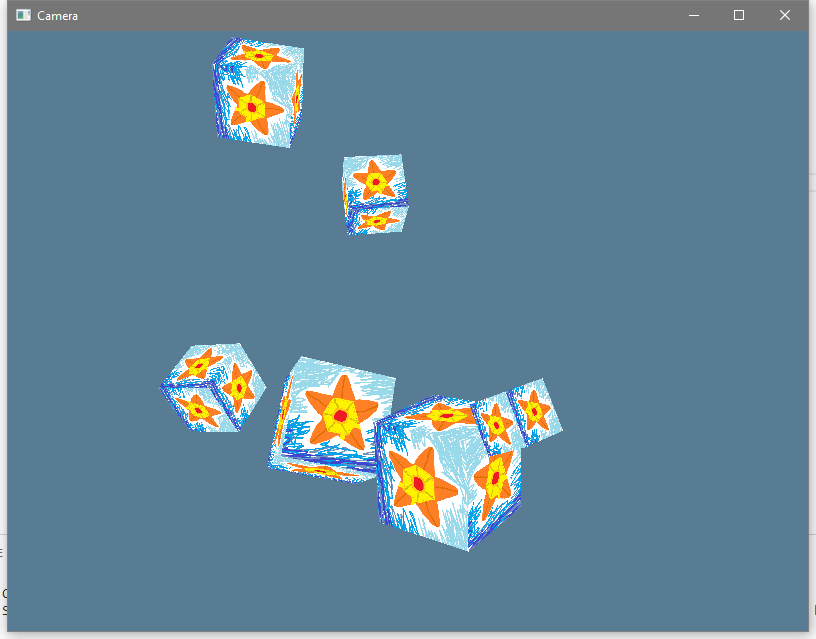

# Camera

Now that we've got everything in the right coordinate system, let's play around
a little bit with that.

Quick Review:

A **Transformation** converts a point within one coordinate system into a new
point in either the same coordinate system or a new coordinate system. When you
apply the same transformation to a group of points, you can **Translate**
(position change), **Rotate** (orientation change), or **Scale** (size change)
that whole group.

* The Model Matrix transforms model space points into world space points. It
  "places" the model within the world. A "model" can be any collection of
  points, from a single point or a single line segment all the way up to _Geralt
  of Rivea_ (clocking in at around 30,000 triangles in his Witcher 2 model,
  according to a quick google).
* The View Matrix transforms world space into view space. Instead of placing the
  camera in the world, it's actually the opposite sort of effect. It re-places
  everything within the whole world into the camera's vision of things, with the
  camera at the view space origin.
* The Projection Matrix transforms view space into Normalized Device
  Coordinates. This acts like the "lens" of the camera, and it's where things
  like field of view angle come into play.

So in this lesson we'll first show an Orthographic Projection matrix, and then
we'll focus on two different camera types.

Side Note: Within math in general there _are_ also other types of transformation
besides translate, rotate, and scale. However, we don't use them in our graphics
programming.

## Quick Patch

I've forgotten until now, but there's an important little bit you'll want to
know about on Windows. There's a special attribute that you can set on your
program to make it not have an attached console. This makes it so that if you
run the program from outside of a terminal it won't open up a dummy terminal in
the background.

`windows_subsystem = "windows"`

However, this also makes it so that the program can't do terminal output _even
if_ it was run from a terminal. Since we want to see terminal debug output stuff
in debug builds, we want to only activate this attribute in builds _without_
`debug_assertions`.

```rust
#![cfg_attr(not(debug_assertions), windows_subsystem = "windows")]
```

(Note: if you have `windows_subsystem = "windows"` set on a program and run it
from the command line of a terminal _other than_ `cmd.exe` and PowerShell (eg:
Git Bash) you might still get terminal output. But you have to ask yourself, who
would be so heretical?

# Orthographic Projection

I mentioned it in passing before, but there's a second major category of
projection that you might sometimes use. We're currently using
[Perspective](https://en.wikipedia.org/wiki/3D_projection#Perspective_projection),
which makes things look "real" because parallel lines will converge as they move
away from you. There's also
[Orthographic](https://en.wikipedia.org/wiki/3D_projection#Orthographic_projection),
which makes things look more "tactical" because parallel lines _don't_ meet up
in the distance. Like SimCity or Civilization.

Since our scene is a bunch of cubes floating around in space, the orthographic
projection is going to look kinda weird, but we'll slot it in there as an
option. When the users presses the Tab key it'll flip a bool to swap between the
two projections.

## Update `draw_cubes_frame`

First, we'll want to control the view and projection as part of our LocalState
now. That makes sense, in a game the camera position is more a part of the game
state than a part of the graphics driver.

We just adjust the function to accept a `view_projection` matrix that it's given
for the scene, and we'll just decide what the view and projection are before we
call here.

```rust
  pub fn draw_cubes_frame(
    &mut self, view_projection: &glm::TMat4<f32>, models: &[glm::TMat4<f32>],
  ) -> Result<(), &'static str> {
```

## Update `UserInput`

Now we have to track if the user wants us to swap the projection. First we add
another field to the inputs.

```rust
#[derive(Debug, Clone, Default)]
pub struct UserInput {
  pub end_requested: bool,
  pub new_frame_size: Option<(f64, f64)>,
  pub new_mouse_position: Option<(f64, f64)>,
  pub swap_projection: bool,
  pub seconds: f32,
}
```

Then we add another match case to our event polling:

```rust
      Event::WindowEvent {
        event:
          WindowEvent::KeyboardInput {
            input:
              KeyboardInput {
                state: ElementState::Pressed,
                virtual_keycode: Some(VirtualKeyCode::Tab),
                ..
              },
            ..
          },
        ..
      } => {
        // Each time we see TAB we flip if a projection swap has been requested.
        // This will probably only happen once per frame anyway.
        output.swap_projection = !output.swap_projection;
      }
```

Ya get all that? It's pretty wordy, but that's just the `winit` way to say "Tab
was pressed": KeyboardInput + EventState::Pressed + VirtualKeyCode::Tab.

## Update `LocalState`

Now the `LocalState` will hold two different projection matrices: one for
perspective and one for orthographic. We'll flip which one we use with a bool.

```rust
#[derive(Debug, Clone)]
pub struct LocalState {
  pub frame_width: f64,
  pub frame_height: f64,
  pub mouse_x: f64,
  pub mouse_y: f64,
  pub cubes: Vec<glm::TMat4<f32>>,
  pub view: glm::TMat4<f32>,
  pub perspective_projection: glm::TMat4<f32>,
  pub orthographic_projection: glm::TMat4<f32>,
  pub is_orthographic: bool,
  pub spare_time: f32,
}
```

Which means we add a bit to our "update from user input" method:

```rust
    if input.swap_projection {
      self.is_orthographic = !self.is_orthographic;
    }
```

and now we need to initialize all the new data when we first make the LocalState
value. Once again, `nalgebra-glm` has many different `orthographic` projections
to pick from, and we want `_lh_zo`. This time instead of picking an aspect ratio
and view angle (plus near plane and far plane) we pick the left, right, bottom,
and top bounds of the view (plus near plane and far plane). The bounds are in
world coordinates, and I picked +/- 5.0 since our cubes are in that general
area. For your own code you'd need to decide on a comfortable value based on
your world scale and such.

```rust
    LocalState {
      frame_width,
      frame_height,
      mouse_x: 0.0,
      mouse_y: 0.0,
      cubes: vec![
        glm::identity(),
        glm::translate(&glm::identity(), &glm::make_vec3(&[1.5, 0.1, 0.0])),
        glm::translate(&glm::identity(), &glm::make_vec3(&[-3.0, 2.0, 3.0])),
        glm::translate(&glm::identity(), &glm::make_vec3(&[0.5, -4.0, 4.0])),
        glm::translate(&glm::identity(), &glm::make_vec3(&[-3.4, -2.3, 1.0])),
        glm::translate(&glm::identity(), &glm::make_vec3(&[-2.8, -0.7, 5.0])),
      ],
      spare_time: 0.0,
      view: glm::look_at_lh(
        &glm::make_vec3(&[0.0, 0.0, -5.0]),
        &glm::make_vec3(&[0.0, 0.0, 0.0]),
        &glm::make_vec3(&[0.0, 1.0, 0.0]).normalize(),
      ),
      perspective_projection: {
        let mut temp = glm::perspective_lh_zo(800.0 / 600.0, f32::to_radians(50.0), 0.1, 100.0);
        temp[(1, 1)] *= -1.0;
        temp
      },
      orthographic_projection: {
        let mut temp = glm::ortho_lh_zo(-5.0, 5.0, -5.0, 5.0, 0.1, 100.0);
        temp[(1, 1)] *= -1.0;
        temp
      },
      is_orthographic: false,
    }
```

And then in do_the_render we pick the right projection, combine it with our
view, and call `draw_cubes_frame`:

```rust
fn do_the_render(hal_state: &mut HalState, local_state: &LocalState) -> Result<(), &'static str> {
  let projection = if local_state.is_orthographic {
    local_state.orthographic_projection
  } else {
    local_state.perspective_projection
  };
  let view_projection = projection * local_state.view;
  hal_state.draw_cubes_frame(&view_projection, &local_state.cubes)
}
```

Now we can see how ugly an orthographic projection is!

Well, it's not always ugly, but we'd really need to have a different sort of
scene of stuff to look at if we wanted it to look good. Unfortunately that's a
little out of scope at the moment, so I'll leave trying that out up to you now
that you know what to do. Right now I just wanted you to know that it's
_possible_, and let you have a sense of why the `view` and `projection` matrix
data isn't always just a single matrix based on the camera position.

# Euler Angle FPS Camera

Ultimately a camera is just about picking a **location** and **orientation** of
where you're looking at things from. However, there's actually a few major types
of camera similar to how there's a few major types of projection.

First we'll go over a camera that uses "[Euler
Angles](https://en.wikipedia.org/wiki/Euler_angles)" to act like a First Person
Shooter (FPS) camera. It's probably the easiest style of camera to think about.
Euler angles means `pitch`, `roll`, and `yaw`. Like a plane.

* `pitch`: angle up and down
* `roll`: angle rocking side to side
* `yaw`: angle left and right

Actually, I lied just now, we **won't** be handling `roll`. If you allow the
user to adjust their `roll` value as much as they want they can trigger a
[Gimbal Lock](https://en.wikipedia.org/wiki/Gimbal_lock). For most first person
experiences you don't need roll at all, so we'll block the user from
accidentally giving themselves problems.

Also, we'll limit the maximum `pitch` value to +/- 89 degrees. You remember that
`up` vector thing from the `look_at` projection? If the `pitch` is allowed to
hit 90 degrees then the `up` vector and the `front` vector line up and that's a
problem too. Technically you _could_ get around this pitch limitation, but
letting the user get flipped over backwards is probably good enough reason to
keep it in. Most users are actually very comfortable with the idea that they
can't just look up more and more until their perspective has flipped over
entirely, so it's still "professional quality" to have this limit in place.

If you _do_ want to enable total freedom of movement that'll be available in
the next camera we go over.

## EulerCamera Struct

So we need a _location_ and _orientation_. Our struct can hold exactly that:

```rust
#[derive(Debug, Clone, Copy)]
pub struct EulerFPSCamera {
  pub position: glm::TVec3<f32>,
  pitch_deg: f32,
  yaw_deg: f32,
}
```

We've got a little extra note there in the names that the pitch and yaw will be
in degrees, because degrees are usually easier for a human to think about, but
the `sin` and `cos` functions are for `radians`, so when we eventually call
those we'll need a conversion first.

Now we declare the "up" vector, which is always the same for this particular
camera. We need it for moving the camera and also for creating the `look_at`
view matrix. Unfortunately, I'm not seeing a `const` function for making a TVec3
value, so we'll declare the array as a const and then just convert it into a
TVec3 when we need to.

```rust
impl EulerCamera {
  const UP: [f32; 3] = [0.0, 1.0, 0.0];
```

Next we want a "front" or "forward" vector. This is a vector that points forward
out of the camera into the world. We're actually tracking our pitch and yaw as
angles, but we'll need the front vector for doing movement and computing the
`look_at` matrix. This involves some `sin` and `cos` calls, so we have to
convert our degree values into radian values. If we wanted we could cache this
vector along side our angle values, but that's not really necessary (you
probably only touch your camera once per frame) so we'll keep it simple and just
build the vector from scratch each time.

```rust
  fn make_front(&self) -> glm::TVec3<f32> {
    let pitch_rad = f32::to_radians(self.pitch_deg);
    let yaw_rad = f32::to_radians(self.yaw_deg);
    glm::make_vec3(&[
      yaw_rad.sin() * pitch_rad.cos(),
      pitch_rad.sin(),
      yaw_rad.cos() * pitch_rad.cos(),
    ])
  }
```

Orientation updates are pretty simple, but we have to be mindful of the limits
we talked about. We'll cap `pitch` at +/- 89 degrees, and we'll make sure that
the `yaw` value gets wrapped to being within +/- 360.0 degrees. Remember that
floats are more accurate the closer they are to zero, and we don't want any
weird accuracy problems creeping up on us.

```rust
  pub fn update_orientation(&mut self, d_pitch_deg: f32, d_yaw_deg: f32) {
    self.pitch_deg = (self.pitch_deg + d_pitch_deg).max(-89.0).min(89.0);
    self.yaw_deg = (self.yaw_deg + d_yaw_deg) % 360.0;
  }
```

Now we need a way to update the _position_ of the camera. First of all, you can
just assign the camera any new position at any time and it'll work right. However, we also want to support going "forward" and "sideways" relative to the current perspective (like you do in a first person game), so we'll want a method for that.

We take in which keys are being held down and then how far the camera should
move in whatever direction the keys determine. The distance moved is
camera_speed * time_elapsed, but whoever calls `update_position` can just
compute that on their side before they call us.

The way that this works is that we first gather up all the deltas that the keys
are trying to get us to do. If that total is zero we didn't move so we're done.
If it's non-zero we first have to normalize the direction vector. If we didn't
normalize our direction vector then moving forward _or_ sideways would be "1"
unit of distance but moving forward _and_ sideways would end up being "1.4"
(technically `sqrt(2)`) units of distance ([Pythagorean
theorem](https://en.wikipedia.org/wiki/Pythagorean_theorem), yo). It's pretty
silly for diagonal movement to be faster than direct movement, and even
professional games such as
[Morrowind](https://en.wikipedia.org/wiki/The_Elder_Scrolls_III:_Morrowind) and
[Obduction](https://en.wikipedia.org/wiki/Obduction_(video_game)) make this easy
mistake.

Once we have our normalized direction vector, we scale the vector by our
distance value and add it to our position.

```rust
  pub fn update_position(&mut self, keys: &HashSet<VirtualKeyCode>, distance: f32) {
    let up = glm::make_vec3(&Self::UP);
    let forward = self.make_front();
    let cross_normalized = glm::cross::<f32, glm::U3>(&forward, &up).normalize();
    let mut move_vector =
      keys
        .iter()
        .fold(glm::make_vec3(&[0.0, 0.0, 0.0]), |vec, key| match *key {
          VirtualKeyCode::W => vec + forward,
          VirtualKeyCode::S => vec - forward,
          VirtualKeyCode::A => vec + cross_normalized,
          VirtualKeyCode::D => vec - cross_normalized,
          VirtualKeyCode::E => vec + up,
          VirtualKeyCode::Q => vec - up,
          _ => vec,
        });
    if move_vector != glm::zero() {
      move_vector = move_vector.normalize();
      self.position += move_vector * distance;
    }
  }
```

I've implemented it as a "flying" style camera here. It uses the front vector
for movement, so if you look up while going forward then you also move up
(depending on pitch). I've also set `Q` and `E` to shift the camera directly up
and down. If that's not appropriate for your own program then you'd want to
compute a forward vector with just X and Z changes based on `yaw` alone. What
you'd probably actually want is to directly place the camera within the location
given to you by some physics object as it moves through the simulation, and just
let the physics system handle all the position updates. Just assigning to the
position field directly is fine, that's why it's `pub`.

(Note, the `A` and `D` math is sensitive to the fact that the projection matrix
is flipping `Y` values _after_ they pass through the View matrix. In other
words, if you port this code to OpenGL where `Y` is up naturally then you'll
need to flip which one is `+` and which one is `-`, otherwise you'll move
left/right flipped).

Finally, now that we can adjust the details on our camera, we just need to ask
it to please give us the correct view matrix.

```rust
  pub fn make_view_matrix(&self) -> glm::TMat4<f32> {
    glm::look_at_lh(
      &self.position,
      &(self.position + self.make_front()),
      &glm::make_vec3(&Self::UP),
    )
  }
```

Oh, and it needs at least one constructor because of those private fields. Let's
give it a const constructor for being at a particular position. Always nice to
have a const constructor if you can manage it.

```rust
  pub const fn at_position(position: glm::TVec3<f32>) -> Self {
    Self {
      position,
      pitch_deg: 0.0,
      yaw_deg: 0.0,
    }
  }
```

## Update `LocalState`

Now that we've got this nice camera we can replace out view matrix field with a
camera field.

```rust
#[derive(Debug, Clone)]
pub struct LocalState {
  pub frame_width: f64,
  pub frame_height: f64,
  pub mouse_x: f64,
  pub mouse_y: f64,
  pub cubes: Vec<glm::TMat4<f32>>,
  pub camera: EulerCamera,
  pub perspective_projection: glm::TMat4<f32>,
  pub orthographic_projection: glm::TMat4<f32>,
  pub is_orthographic: bool,
  pub spare_time: f32,
}
```

And in the LocalState initializer we need to place the camera at the same
position as before.

```rust
camera: EulerCamera::at_position(glm::make_vec3(&[0.0, 0.0, -5.0])),
```

which means that `do_the_render` needs a minor update to get a view matrix in
the new way.

```rust
fn do_the_render(hal_state: &mut HalState, local_state: &LocalState) -> Result<(), &'static str> {
  let projection = if local_state.is_orthographic {
    local_state.orthographic_projection
  } else {
    local_state.perspective_projection
  };
  let view_projection = projection * local_state.camera.make_view_matrix();
  hal_state.draw_cubes_frame(&view_projection, &local_state.cubes)
}
```

That finally brings us to `LocalState::update_from_input`.

This part is a little bit of a pickle. We're updating our "physics" by 1/60th of
a second every 1/60th of a second. However, we're accepting input faster than
that in some cases (if Mailbox mode is selected). Does the camera count as part
of our physics? Can we do some updates to it faster than 60fps and then others
at only 60fps? Should we buffer _all_ updates until the next physics frame and
only do them exactly when the rest of the physics happens? Well, unfortunately
that's an answer you'll need to sort out for yourself.

Our camera isn't _really_ connected to anything, but if your camera **is**
connected to an actual physics entity (like a player entity) then you'd probably
need to buffer up the inputs that come in faster than 60fps, do your physics at
the right time, and then update your camera only in response to the physics
simulation result. Or you could not even use Mailbox mode if you don't want to
worry about it possibly being there and possibly not being there.

For our example, I'll have the camera code be disjoint from the physics code
just to see how it would be done if you wanted to do it that way.

```rust
    // do camera updates distinctly from physics, based on this frame's time
    const MOUSE_SENSITIVITY: f32 = 0.05;
    let d_pitch_deg = input.orientation_change.1 * MOUSE_SENSITIVITY;
    let d_yaw_deg = -input.orientation_change.0 * MOUSE_SENSITIVITY;
    self.camera.update_orientation(d_pitch_deg, d_yaw_deg);
    self
      .camera
      .update_position(&input.keys_held, 5.0 * input.seconds);
```

## Update `UserInput`

So obviously our user input is storing a few more things than before, let's look at that.

```rust
#[derive(Debug, Clone, Default)]
pub struct UserInput {
  pub end_requested: bool,
  pub new_frame_size: Option<(f64, f64)>,
  pub new_mouse_position: Option<(f64, f64)>,
  pub swap_projection: bool,
  pub keys_held: HashSet<VirtualKeyCode>,
  pub orientation_change: (f32, f32),
  pub seconds: f32,
}
```

Okay, and we're actually going to be tracking quite a bit more now, so our
polling method has a few more arguments.

```rust
  pub fn poll_events_loop(
    winit_state: &mut WinitState, last_timestamp: &mut SystemTime,
    keys_held: &mut HashSet<VirtualKeyCode>, focused: &mut bool, grabbed: &mut bool,
  ) -> Self {
```

Actually, all that stuff has to do with `winit` really, so it should be in the
`WinitState`, don't you think? We're already taking a `&mut WinitState`.

```rust
#[derive(Debug)]
pub struct WinitState {
  pub events_loop: EventsLoop,
  pub window: Window,
  pub keys_held: HashSet<VirtualKeyCode>,
  pub grabbed: bool,
}
```

Alright, and now our match statement is totally different, so we'll take it
again from the top. First though, we have to do an annoying manual split of the
borrow.

```rust
impl UserInput {
  pub fn poll_events_loop(winit_state: &mut WinitState, last_timestamp: &mut SystemTime) -> Self {
    let mut output = UserInput::default();
    // We have to manually split the borrow here. rustc, why you so dumb sometimes?
    let events_loop = &mut winit_state.events_loop;
    let window = &mut winit_state.window;
    let keys_held = &mut winit_state.keys_held;
    let grabbed = &mut winit_state.grabbed;
```

Now we can start the events poll. First up is CloseRequested, which we just mark
down in our output.

```rust
    // now we actually poll those events
    events_loop.poll_events(|event| match event {
      // Close when asked
      Event::WindowEvent {
        event: WindowEvent::CloseRequested,
        ..
      } => output.end_requested = true,
```

Next we need to track what the state of all keys is. This is a little annoying
at the edge cases, because of [key
rollover](https://en.wikipedia.org/wiki/Rollover_(key)), and also because if the
uses presses and holds a key _before the window opens_ we won't get the key
press event for that. Most of the time though we can fairly reliably get key
info. Now there's two ways to do this: one is through the
[WindowEvent](https://docs.rs/winit/0.18.1/winit/enum.WindowEvent.html) type and
the other is through the
[DeviceEvent](https://docs.rs/winit/0.18.1/winit/enum.DeviceEvent.html) type. We
want to use DeviceEvent. The difference is that you only get window events for
keys when your window is active, but you get device events at all times. If the
user presses or releases a key when the window is out of focus we want to track
that. If they press a key and then click in the window, we want to respond to
that _right away_ without them having to release and press the key again.
Similarly, if they have a key held and then switch to another window, we want to
know if it got released while we didn't have focus.

```rust
      // Track all keys, all the time. Note that because of key rollover details
      // it's possible to get key released events for keys we don't think are
      // pressed. This is a hardware limit, not something you can evade.
      Event::DeviceEvent {
        event:
          DeviceEvent::Key(KeyboardInput {
            virtual_keycode: Some(code),
            state,
            ..
          }),
        ..
      } => drop(match state {
        ElementState::Pressed => keys_held.insert(code),
        ElementState::Released => keys_held.remove(&code),
      }),
```

That would be the end of it, but macOS doesn't provide keys as
device events. So we need to handle keys as window events too. Also, even on
non-mac there's a few window event keys that we want to respond do. We're
keeping "tab swaps the projection", and also we're adding "escape undoes the
grab".

```rust
// We want to respond to some of the keys specially when they're also
      // window events too (meaning that the window was focused when the event
      // happened).
      Event::WindowEvent {
        event:
          WindowEvent::KeyboardInput {
            input:
              KeyboardInput {
                state,
                virtual_keycode: Some(code),
                ..
              },
            ..
          },
        ..
      } => {
        #[cfg(feature = "metal")]
        {
          match state {
            ElementState::Pressed => keys_held.insert(code),
            ElementState::Released => keys_held.remove(&code),
          }
        };
        if state == ElementState::Pressed {
          match code {
            VirtualKeyCode::Tab => output.swap_projection = !output.swap_projection,
            VirtualKeyCode::Escape => {
              if *grabbed {
                debug!("Escape pressed while grabbed, releasing the mouse!");
                window
                  .grab_cursor(false)
                  .expect("Failed to release the mouse grab!");
                window.hide_cursor(false);
                *grabbed = false;
              }
            }
            _ => (),
          }
        }
      }
```

We also want to use `DeviceEvent` to track mouse motion. The difference between
this and the `CursorMoved` event from before is that `WindowEvent::CursorMoved`
gives the _position within the window_, while `DeviceEvent::MouseMotion` gives
the mouse's _position delta_. We're going to "grab" the mouse to lock it within
the window. When the mouse goes all the way to left and hits x=0 we'd stop
getting CursorMoved events, but we want to keep turning the view as long as the
user keeps turning the mouse. By using `MouseMotion` events we can track the
mouse's intended movement even while the cursor is grabbed.

Also, this is the part where you'd invert the X or Y movement effect if you
wanted to offer that option to users.

```rust
      // Always track the mouse motion, but only update the orientation if
      // we're "grabbed".
      Event::DeviceEvent {
        event: DeviceEvent::MouseMotion { delta: (dx, dy) },
        ..
      } => {
        if *grabbed {
          output.orientation_change.0 -= dx as f32;
          output.orientation_change.1 -= dy as f32;
        }
      }
```

Next, if the user clicks in the window we'll grab the cursor. There's a literal
`grab_cursor` call which _on Windows_ will automatically hide the cursor too,
but on macOS and some Linux distributions you have to issue `hide_cursor` as a separate
command.
We'll just do both, since it doesn't hurt to tell the already-hidden cursor to
hide again on Windows.

```rust
      // Left clicking in the window causes the mouse to get grabbed
      Event::WindowEvent {
        event:
          WindowEvent::MouseInput {
            state: ElementState::Pressed,
            button: MouseButton::Left,
            ..
          },
        ..
      } => {
        if *grabbed {
          debug!("Click! We already have the mouse grabbed.");
        } else {
          debug!("Click! Grabbing the mouse.");
          window.grab_cursor(true).expect("Failed to grab the mouse!");
          window.hide_cursor(true);
          *grabbed = true;
        }
      }
```

If the focus is lost, we want to automatically release any "grab". This is just
the same two calls with reverse values.

```rust
      // Automatically release the mouse when focus is lost
      Event::WindowEvent {
        event: WindowEvent::Focused(false),
        ..
      } => {
        if *grabbed {
          debug!("Lost Focus, releasing the mouse grab...");
          window
            .grab_cursor(false)
            .expect("Failed to release the mouse grab!");
          window.hide_cursor(false);
          *grabbed = false;
        } else {
          debug!("Lost Focus when mouse wasn't grabbed.");
        }
      }
```

Finally, we'll update our window size still. I'm not sure we're using that any
more, but oh well. We can just track it anyway.

```rust
      // Update our size info if the window changes size.
      Event::WindowEvent {
        event: WindowEvent::Resized(logical),
        ..
      } => {
        output.new_frame_size = Some((logical.width, logical.height));
      }
```

And at the end, after the event polling, we want to be sure to hand over a clone
of the `keys_held` set _only if_ we're grabbed. Otherwise the program would do
stuff even if it's out of focus. I'm sure there's some program that wants to do
that, but not us.

```rust
    output.keys_held = if *grabbed {
      keys_held.clone()
    } else {
      HashSet::new()
    };
```

And everything works!

Except we can't roll yet.

# Quaternion Free Camera (Slightly Slower, More Freedom)
_"what's going on? oh god quaternions, no effin' clue" -Xavil_

Now we're gonna use [Quaternions](https://en.wikipedia.org/wiki/Quaternion).
They're not super covered in the Khan Academy "Vector and Matrix" math course
that I linked last lesson, at least not from what I saw in their table of
contents listing. Instead, try [this link
here](https://www.3dgep.com/understanding-quaternions/) to learn about them, or
perhaps
[here](http://www.opengl-tutorial.org/intermediate-tutorials/tutorial-17-quaternions/)
if you want a short version that's mostly computer graphics oriented. You could
also try [these videos](https://eater.net/quaternions/) if you're better at
learning through video. Quaternion are sure _weird_. They're 4D! Isn't that
already pretty weird all on its own?

With the power of quaternions at our finger tips we're going to make a "free
camera", which means that we can pitch, yaw, _and also roll_ as much as we want.
There's still a _mild_ limit that if there's a large change in more than one
axis in a single `update_orientation` call then you could trigger a gimbal lock,
but for normal use that's not a danger, and if you really need to do big
orientation changes you can break it into a series of smaller changes.

The math here is actually so complicated that I honestly don't know how most of
it works exactly. However, [termhn](https://github.com/termhn) managed to ~~help
me~~ _just tell me what to try over and over until it worked_ and we got a
quaternion free camera going with only mild struggles. Cargo cult programming at
its finest.

So we start with our QuaternionFreeCamera struct, once again we have a public
position field and an internal way to track our orientation. Instead of storing
euler angles we store a quaternion.

```rust
#[derive(Debug, Clone, Copy)]
pub struct QuaternionFreeCamera {
  pub position: glm::TVec3<f32>,
  quat: glm::Qua<f32>,
}
```

Now we want to update the orientation. How do we even update a quaternion? Well,
you don't do it directly in an `x += 1` sort of way. Instead, if we take the
desired change in orientation as a quaternion, we can multiply it by our current
quaternion and the output quaternion is our old one with the change applied.
This is somewhat magical, but it's _similar_ to how you can multiply one
transformation matrix with another and they "combine" into a new transformation.

And I promised that this time we can roll too, so our update function starts
like this:

```rust
impl QuaternionFreeCamera {
  pub fn update_orientation(&mut self, d_pitch: f32, d_yaw: f32, d_roll: f32) {
    unimplemented!();
  }
```

Please note that we're _no longer dealing in degrees_. You'll see why in a
moment.

Alright so what _is_ a quaternion? Well it's just a way to talk about a 3d
sphere on the surface of a 4d hypersphere. Obviously. Totally normal concept.
How do we represent a quaternion? Well, there's one real axis and three
imaginary axes. You know how a standard imaginary number is like `a + bi`?
That's one real axis and one imaginary axis. A quaternion is just more imaginary
axes, so we write them as `a + bi + cj+ dk`.

In code terms, a quaternion is basically four `f32` values (well, could be
`f64`, but you know). Normally to make a quaternion you'd use an angle and 3d
axis. The angle is of course in radians and then axis should of course be
normalized. Then you use this formula to get the four components:

```
x = RotationAxis.x * sin(RotationAngle / 2)
y = RotationAxis.y * sin(RotationAngle / 2)
z = RotationAxis.z * sin(RotationAngle / 2)
w = cos(RotationAngle / 2)
```

You'll notice that we've switched from `a`, `b`, `c`, and `d` to using `x`, `y`,
`z`, and `w`. That's the convention. Presumably because folks wanted to have a
component output that's related to the input `x` axis also be named `x` and
such. So now our "real" component is the `w` value at the end of the list, not
the `a` value at the start of the list. Important to keep that straight.

So we could easily call
[nalgebra_glm::quat_angle_axis](https://docs.rs/nalgebra-glm/0.2.1/nalgebra_glm/fn.quat_angle_axis.html)
to make a quaternion... but we don't _have_ an axis and angle. We have euler
angles in unknown units.

This is where it gets strange. You see, I read [an
article](http://in2gpu.com/2016/03/14/opengl-fps-camera-quaternion/) that
implied that you can just throw the delta values directly into a quaternion and
it works. That is, if you call
[nalgebra_glm::quat](https://docs.rs/nalgebra-glm/0.2.1/nalgebra_glm/fn.quat.html)
you _can_ specify `x`, `y`, `z`, and `w` without needing to know an axis and
angle. Normally you probably wouldn't do this unless you were reading in a
quaternion from a file or something, but that's what the article said to do. I
tried it, and it works. I was just as shocked as you to see this.

```rust
    let delta_quat = glm::quat(d_pitch, d_yaw, d_roll, 1.0);
```

So I asked around and [PinoBatch](https://github.com/pinobatch) pointed me to a
thing called [Paraxial
Approximation](https://en.wikipedia.org/wiki/Paraxial_approximation). If you
have a very small angle (<10 degrees) you can skip computing a `sin` and just
use the value directly with minimal error compared to having done the `sin`. So
if we assign an input delta directly to `x`, `y`, or `z` we can _act like_ we
did the right thing for some small rotation angle and just get a de-normalized
quaternion value. Okay? So that means that our inputs are effectively _double
radians_. Obviously(?). If we want to change 1 degree, that's 0.0175 radians,
and so we'd want only `0.00875` for our delta value.

Well, _almost_. Because we've got three deltas and we need four parts, so what's
our `w` value? [groves](https://github.com/grovesNL) suggested that "1 is
usually the identity", so we started with that. And it worked. Do other values
for `w` work? Yes they also work. As long as the value isn't 0 then it works.
And smaller `w` makes you spin faster, while large `w` makes you spin slower. So
if `w` can affect the rotation speed.... what?

Okay, _this_ is where [ax6](https://github.com/aaaaaa123456789) swooped in because
they know quaternions and they don't like cargo cult programming.

So imagine that we wanted to adjust _just one_ axis. That's easy. Keeping in
mind that we're using _double_ radians in place of radians, each axis has a
formula for it like this:

```
// double radian formulas, divide the angle by 2 for normal radians
q(pitch) = cos(pitch) + (sin(pitch), 0, 0)
q(yaw) = cos(yaw) + (0, sin(yaw), 0)
q(roll) = cos(roll) + (0, 0, sin(roll))
```

So we just pick one of those and 

```
new = old * q(yaw)
```

But we want three adjustments. Okay, so just like with stacking up matrix
transforms we can stack up quaternion multiplications by adding more on the
right.

```
new = old * q(yaw) * q(pitch) * q(roll)
```

But what does that _actually_ mean if you expand it out?

```
q(yaw) * q(pitch) = (cos yaw + (0, sin yaw, 0)) * (cos pitch + (sin pitch, 0, 0))
```

or alternately

```
(cos yaw * cos pitch) + (cos yaw * sin pitch, sin yaw * cos pitch, - sin yaw * sin pitch)
```

And then we multiply in the q(roll) on the right to get...

```
q = (cos yaw * cos pitch * cos roll - sin yaw * sin pitch * sin roll) +
  (cos yaw * sin pitch * cos roll + sin yaw * cos pitch * sin roll,
  sin yaw * cos pitch * cos roll - cos yaw * sin pitch * sin roll,
  cos yaw * cos pitch * sin roll - sin yaw * sin pitch * cos roll)
```

Which is _extremely ugly_, but this is where the Paraxial Approximation kicks
in:

1) cos(foo) = 1, since the angles are small
2) sin(foo) = foo, since the angles are small
3) sin(foo) * sin(bar) = 0, because with angles being that small, multiplying
   two of them gives a tiny number that almost vanishes

So all cosines are cancelled out, any term with more than one sine is wholly
cancelled out, and all remaining sines are replaced by the actual angles and you
get an approximation of

```
q = 1 + (pitch, yaw, roll)
```

Since we do a normalization step after multiplying our old quaternion by the
delta quaternion, the approximation is close enough to let it all work out. Our
effective rotation angle of the delta quaternion is `2 * arccos(Re(q) / |q|)`,
with `Re(q)` being "the real part of `q`", meaning `w`.  Since `arccos` has a
negative derivative, increasing the `w` value reduces the angle of rotation.

**So, if you didn't get all that, it's okay.** It's totally fine. We're _deep_
into the realm of magic here, so if you just want to use this code without
understanding why exactly it all adds up that's okay. Honestly I don't quite get
it myself. Now we finally know how to update our orientation at least:

```rust
  /// Updates the orientation of the camera.
  ///
  /// Inputs should be in double radians, and also limited to being less than 10
  /// degrees at a time to keep approximation error minimal.
  pub fn update_orientation(&mut self, d_pitch_2rad: f32, d_yaw_2rad: f32, d_roll_2rad: f32) {
    // This gives a non-unit quaternion! That's okay because of the normalization step.
    let delta_quat = glm::quat(d_pitch_2rad, d_yaw_2rad, d_roll_2rad, 1.0);
    self.quat = glm::quat_normalize(&(self.quat * delta_quat));
  }
```

To update the position we do mostly the same things as the EulerFPSCamera did.

We sum up all the directions we're trying to go, check that it's non-zero, if so
we normalize it. Then there's a change: we can't yet adjust the magnitude and
then add. First we have to rotate our normalized vector vector with our
quaternion to give it the correct orientation relative to our own orientation.
Once it's rotated we multiply and add like before.

In the EulerFPSCamera the re-orientation was "secretly" a part of the
`make_font` computation (see how the front vec is based on the current pitch and
yaw values?). Now that we're storing a quaternion it's a little easier to just
do the re-orientation with a single rotation at the end.

```rust
  pub fn update_position(&mut self, keys: &HashSet<VirtualKeyCode>, distance: f32) {
    let up = glm::make_vec3(&[0.0, 1.0, 0.0]);
    let forward = glm::make_vec3(&[0.0, 0.0, 1.0]);
    let cross_normalized = glm::cross::<f32, glm::U3>(&forward, &up).normalize();
    let mut move_vector =
      keys
        .iter()
        .fold(glm::make_vec3(&[0.0, 0.0, 0.0]), |vec, key| match *key {
          VirtualKeyCode::W => vec + forward,
          VirtualKeyCode::S => vec - forward,
          VirtualKeyCode::A => vec + cross_normalized,
          VirtualKeyCode::D => vec - cross_normalized,
          VirtualKeyCode::E => vec + up,
          VirtualKeyCode::Q => vec - up,
          _ => vec,
        });
    if move_vector != glm::zero() {
      move_vector = move_vector.normalize();
      let rotated_move_vector = glm::quat_rotate_vec3(&self.quat, &move_vector);
      self.position += rotated_move_vector * distance;
    }
  }
```

To make a view matrix from this we have to expand our quaternion into a rotation
matrix, expand out position into a translation matrix, and then invert
`translation * rotation`. We invert the matrix because what the camera is
actually storing is _its own model matrix_. However, we're not trying to put the
camera in the world, we're trying to send the whole world backwards through the
camera. Uh, if that makes sense?

```rust
  pub fn make_view_matrix(&self) -> glm::TMat4<f32> {
    let rotation = glm::quat_to_mat4(&self.quat);
    let translation = glm::translation(&self.position);
    glm::inverse(&(translation * rotation))
  }
```

And of course want a way to make a FreeCamera from just a position:

```rust
  pub fn at_position(position: glm::TVec3<f32>) -> Self {
    Self {
      position,
      quat: glm::quat_identity(),
    }
  }
```

Now we can finally move through box space in any way that we want!

Almost!

We have to update `LocalState` to have the new camera type, and we also have to
update how it computes the orientation deltas. Specifically, we have to turn the
pitch and yaw changes _way_ down. Remember how we talked about the input values
needing to be small? Something like `0.0005` is a comfortable amount for one
frame of change.

Also, we will use `Z` and `C` to roll port and starboard.

```rust
    const MOUSE_SENSITIVITY: f32 = 0.0005;
    let d_pitch = -input.orientation_change.1 * MOUSE_SENSITIVITY;
    let d_yaw = -input.orientation_change.0 * MOUSE_SENSITIVITY;
    let mut d_roll = 0.0;
    if input.keys_held.contains(&VirtualKeyCode::Z) {
      d_roll += 0.00875;
    }
    if input.keys_held.contains(&VirtualKeyCode::C) {
      d_roll -= 0.00875;
    }
    self.camera.update_orientation(d_pitch, d_yaw, d_roll);
    self
      .camera
      .update_position(&input.keys_held, 5.0 * input.seconds);
```



Well, the boxes _still_ draw over each other weird. Next lesson is finally putting
in that Depth Buffer stuff so that we can make them knock it off and act like
proper visuals.

As always, the code for this lesson is in the
[examples/](https://github.com/Lokathor/learn-gfx-hal/tree/master/examples)
directory.
